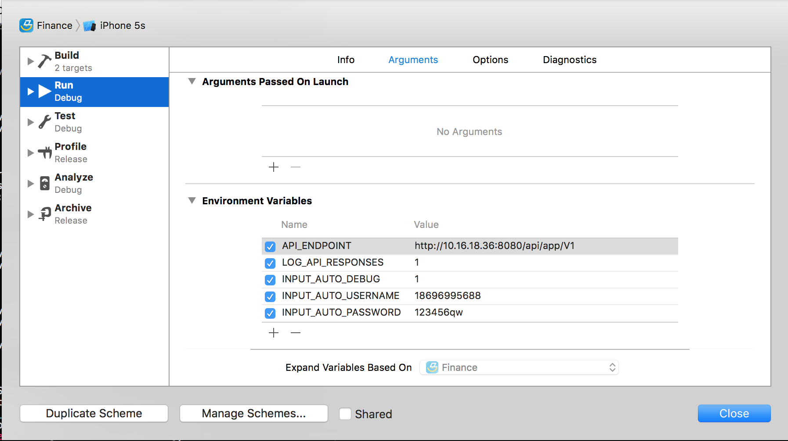

# 马上金融

> 测试接口例

    GET http://api3.msxf.test/api/app/V1/checkVersion?appKey=123456&sign=A06570BACFF07CAD52C1FCC224A63DCC&timestamp=2015-10-19%2011%3A19%3A46&versionCode=2006&versionType=iOS {
        "Accept-Language" = "zh-Hans-US;q=1, en-US;q=0.9";
        "Content-Type" = "application/x-www-form-urlencoded; charset=utf-8";
        "User-Agent" = "Finance/2.0.0 (iPhone; iOS 9.0; Scale/2.00)";
        deviceInfo = "IOS; 9.0; appstore; 2006; Apple; iPhone; iPhone Simulator; 2.0.0.6; 81ccfdae1ba21786428910ad90a0e3ef9f2c9bf7; 0.000000,0.000000; 9; ";
    }  => 200 {
        "Cache-Control" = "max-age=0";
        Connection = close;
        "Content-Type" = "application/json;charset=UTF-8";
        Date = "Mon, 19 Oct 2015 03:18:20 GMT";
        Expires = "Mon, 19 Oct 2015 03:18:20 GMT";
        Server = "nginx/1.8.0";
        "Transfer-Encoding" = Identity;
    }:
    {"timestamp":1445224700175,"status":"0","versionName":null,"lastVersion":null,"lastVersionDescription":null,"updateUrl":null}

## Conventions

- [Style Conventions](./Documentation/style-conventions.md)
- [Objective-C Code Style Guide](./Documentation/objective-c-style-guide.md)
- [Assets](./Documentation/assets.md)

## 日志记录

> Script

    ./Externals/Fabric.framework/run 670b3cf4e9582aba989e7aad7e964a4a41c0e20e 9d02fc1cf0f14796fdac44289d833b82895cfca0be3139f7a66a9f2f7d22fe28

账号：apps@msxf.com
密码：@msxf2015

统计分析：umeng
崩溃收集：fabric

## 测试数据库地址信息

test
url: jdbc:mysql://appservertest2.msxf.dbtest:3306/appserver
username: appserverrw
password: appserver111111

sit3 

url: jdbc:mysql://appserversit3.msxf.dbtest:3306/appserver
username: appserverrw
password: appserver111111

uat2

url: jdbc:mysql://appserveruat2.msxf.dbuat:3306/appserver
username: appserverrw
password: appserver111111

## 发布状态

- Appstore 1.0(2.0.0.28) waiting for review

## 服务器分支说明

* **master** 做最新合并分支,提交代码前先拉取服务器上master合并到`你的本地开发分支`上，解决因此产生的冲突，然后把`你的本地开发分支`提交到对应的服务器`你的服务器开发分支`上.
* **intergrade-1.2.0** 马上贷1.2.0版本，马上贷最后一个升级维护代码.
* **xcode7-1.1.0** 马上贷1.1.0兼容Xcode7分支.
* **xbmDev** 胥佰淼开发分支.
* **zhaoyong** 赵勇开发分支.

## 开发环境说明

开发环境切换的时候不用修改MSFServer.m文件

1. API_ENDPOINT 请求的API地址
2. INPUT_AUTO_DEBUG 请求的时候自动填写帐号/密码
3. LOG_API_RESPONSES 设置运行的时候输出网络调用日志

